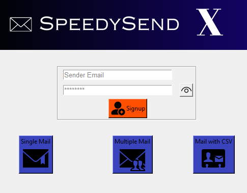

# EmailSenderApp

EmailSenderApp is a sleek Python GUI application powered by Tkinter, designed for effortless email management. It features secure login, intuitive composition, attachment support, and advanced functionalities like draft saving and scheduled sending. Enhance your email experience with EmailSenderApp!

## Table of Contents

- [Installation](#installation)
- [Usage](#usage)
- [Features](#features)
- [Screenshots](#screenshots)
- [Contributing](#contributing)
- [License](#license)

## Installation

Clone the repository and install dependencies:

```bash
git clone https://github.com/your-username/EmailSenderApp.git
cd EmailSenderApp
pip install -r requirements.txt
python main.py
```

## Usage

1. Log in securely with your email credentials.
2. Compose, format, and attach files to your emails.
3. Send emails individually or in bulk.
4. Enjoy advanced features like draft saving and scheduled sending for efficient email management.

## Features

- Secure login
- Intuitive GUI
- Attachment support
- Draft saving
- Scheduled sending
- Error handling and notifications

## Screenshots




## Contributing

Contributions welcome! Fork the repository, create a branch, commit your changes, and open a pull request.

## License

This project is licensed under the MIT License. See the [LICENSE](LICENSE) file for details.

---

Feel free to customize the content and replace placeholders as needed.
